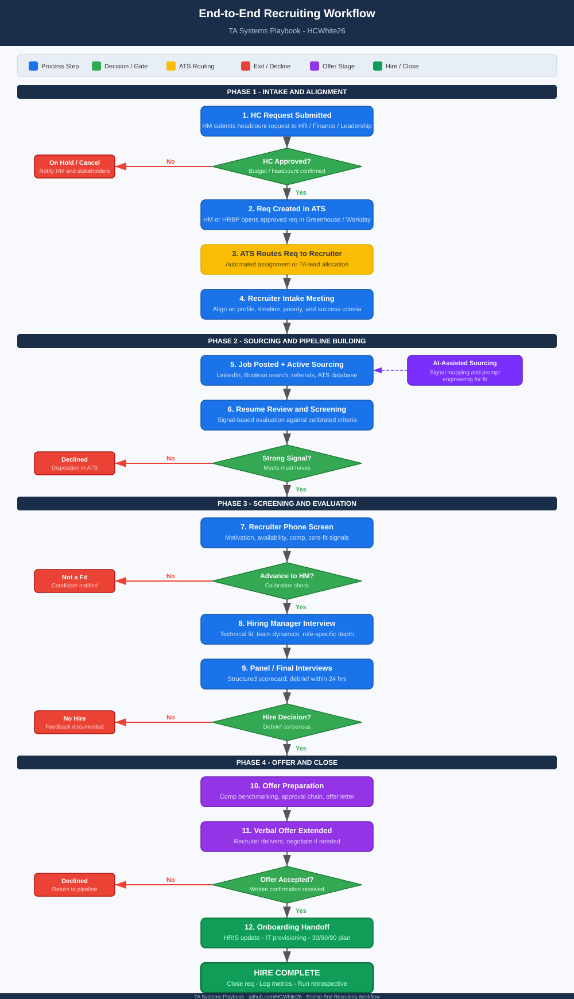

# TA Systems Playbook

A structured, systems-driven collection of frameworks, workflows, and operational models for modern Talent Acquisition.

This playbook reflects a senior, technical-adjacent approach to recruiting — grounded in logic, data, and repeatable processes rather than volume-based tactics.

---

## Workflows

### End-to-End Recruiting Workflow

A scalable, 10-step recruiting workflow diagram covering all four phases of the hiring lifecycle — from intake alignment through offer close and onboarding handoff.

**Phases covered:**
- Phase 1 — Intake & Alignment (Req received, intake meeting, approval gate)
- Phase 2 — Sourcing & Pipeline Building (Active sourcing, AI-assisted signal mapping, resume review)
- Phase 3 — Screening & Evaluation (Recruiter screen, HM interview, panel interviews, hire decision)
- Phase 4 — Offer & Close (Offer prep, verbal offer, acceptance, onboarding handoff)

> View the diagram file directly: [`workflows/recruiting-workflow-diagram.svg`](workflows/recruiting-workflow-diagram.svg)

---

## Repository Structure

| Folder | Contents |
|---|---|
| `/workflows` | End-to-end process maps, decision flows, and recruiting lifecycle diagrams |
| `/frameworks` | Intake, calibration, and evaluation models |
| `/systems` | TA tech stack logic, UAT examples, and configuration notes |
| `/ai` | AI-enabled recruiting workflows and prompt libraries |
| `/documentation` | Templates, SOPs, and operational standards |

---

## Core Areas

- **AI-enabled sourcing workflows**
- **Intake leadership frameworks**
- **Calibration and signal-mapping models**
- **Technical talent evaluation logic**
- **Workflow and process optimization**
- **Recruiter capability models**
- **UAT, defect identification, and systems validation**
- **TA systems logic and documentation standards**

---

## Purpose

To document the core systems, workflows, and decision models that define a mature, scalable TA function.

This repository serves as both:
- A professional portfolio demonstrating TA Systems Analyst capability
- A reference library of reusable frameworks for intake, calibration, sourcing, evaluation, and workflow optimization

---

## Philosophy

Modern TA requires more than sourcing and scheduling — it requires **systems thinking**, operational discipline, and the ability to translate business needs into structured workflows.

This playbook reflects that philosophy: clear logic, repeatable processes, and a focus on signal over noise.

---

*More sections will be added as the playbook evolves.*
