# HC to Requisition Creation Workflow

This workflow represents the corrected business process for how headcount approval leads to requisition creation and assignment within TA.

---

## Workflow Diagram (Text-Based)

Manager Identifies HC Need  
        ↓  
Manager Submits HC Request  
        ↓  
HRBP Review → Finance Review  
        ↓  
HC Approved  
        ↓  
Hiring Manager Notifies TAM  
        ↓  
TAM Creates Requisition  
        ↓  
TAM Assigns Req to TAS  
        ↓  
TAS Begins Sourcing Workflow  

---

## Workflow Notes

- HC approval **must** occur before any requisition is created  
- HRBP and Finance act as the approval gate  
- Hiring Manager does **not** create the requisition  
- TAM owns req creation and setup  
- TAS owns sourcing and candidate movement  
- This workflow prevents shortcut drift and ensures compliance with business logic

```mermaid
flowchart LR

%% STYLES
classDef hm fill:#f9c74f,stroke:#b8860b,stroke-width:1px,color:#000;
classDef hrbp fill:#90be6d,stroke:#2d6a4f,stroke-width:1px,color:#000;
classDef finance fill:#90be6d,stroke:#2d6a4f,stroke-width:1px,color:#000;
classDef tam fill:#4d9de0,stroke:#1d3557,stroke-width:1px,color:#fff;
classDef tas fill:#4d9de0,stroke:#1d3557,stroke-width:1px,color:#fff;
classDef decision fill:#9d4edd,stroke:#5a189a,stroke-width:1px,color:#fff;
classDef stop fill:#f94144,stroke:#7f1d1d,stroke-width:1px,color:#fff;

%% HIRING MANAGER LANE
subgraph Hiring_Manager
direction TB
A[Identify Headcount Need]:::hm
B[Submit Headcount Request]:::hm
end

%% HRBP LANE
subgraph HR_Business_Partner_HRBP
direction TB
C[HRBP Review]:::hrbp
end

%% FINANCE LANE
subgraph Finance
direction TB
D[Finance Review]:::finance
end

%% TAM LANE
subgraph Talent_Acquisition_Manager_TAM
direction TB
F[Hiring Manager Notifies TAM]:::hm
G[TAM Creates Requisition]:::tam
H[TAM Assigns Req to TAS]:::tam
end

%% TAS LANE
subgraph Talent_Acquisition_Specialist_TAS
direction TB
I[TAS Begins Sourcing Workflow]:::tas
end

%% DECISION NODE (OUTSIDE LANES)
E{Headcount Approved?}:::decision

%% FLOW CONNECTIONS
A --> B
B --> C
B --> D
C --> E
D --> E

%% YES PATH
E -->|Yes| F
F --> G
G --> H
H --> I

%% NO PATH
E -->|No| J[Return to Hiring Manager]:::hm
J --> K[Revise Request]:::hm
K --> L[End]:::stop
```

